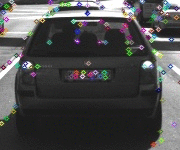
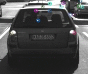
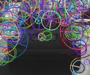
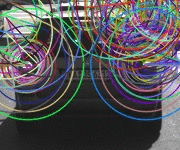

# Project 2: Camera 2D Feature Tracking 
## Sensor Fusion Nanodegree

#### 1. MP.7 Performance Evaluation 1 (Detectors performance)

##### Number of Keypoints
Below is a list of keypoint detectors sorted in descending order 
based on the mean number of keypoints identified among 10 images.  

| FAST  | BRISK | AKAZE | SIFT | SHITOMASI | ORB | HARRIS |
|-------|-------|-------|------|-----------|-----|--------|
| 413   | 272   | 166   | 138  | 118       | 115 | 24     |

#### Keypoint distribution vizualisation

The keypoints from SHITOMASI, HARRIS and FAST only have (x, y) position information, whereas from BRISK, ORB, AKAZE and SIFT include position, orientation and scale such as (x, y, σ, θ). Below is a gifs of sample keypoints detected on all of the 10 test images. 

<table style="width:100%">
  <tr>
    <th>
      

           
            SHITOMASI
      

    </th>
        <th>

           
            HARRIS
        

    </th>
       <th>

           
            FAST
        

    </th>
  </tr>
  <tr>
    <th>

           
            BRISK
        

    </th>
        <th>

           
            ORB
        

    </th>
    <th>

           
            AKAZE
        

    </th>
  </tr>
  <tr>
    <th>

           
            SIFT
        

 </tr>
</table>  

As shown on the output gifs, FAST & BRISK detects most of the keypoints within the preceding vehicle ROI and lies on the edges of the vehicle.

#### 2. MP.8 Performance Evaluation 2 (Matched Keypoints)
For this part, I've counted the number of matched keypoints for all 10 images using all possible combinations of detectors and descriptors. 
In the matching step, Brute Force matching with a distance ratio set to 0.8 has been applied. Further processing method is applied using KNN, with (k=2) to return the best 2 keypoints and use lowe's distance ratio as proposed in the SIFT paper to determine to decide whether to keep an associated pair of keypoints best vs. second-best matched.

Current implementation for detectors are: ["SHITOMASI", "HARRIS", "FAST", "BRISK", "ORB", "AKAZE", "SIFT"].  
Current implementation for descriptors are: ["BRISK", "BRIEF", "ORB", "FREAK", "AKAZE", "SIFT"]. 

As a result, there are 42 combinations, but AKAZE descriptors can only be used with KAZE or AKAZE keypoints and I have not find a method to solve the problem of insufficient memory on the combination of SIFT/ORB. At last, I made a statistics on 35 combinations of detectors and descriptors as being showed on the below table.

#### No. of Matches

Evaluation metrics used are defined below:
* **#Keypoints**: the average number of detected keypoints for all 10 images;
* **T_detector**: the average time of detecting  keypoints on all 10 images;
* **T_descriptor**:  the average time of making descriptors on preceding vehicle for all 10 images;
* **#Matches**:  the average number  of matches between two frames for all 10 images;
* **T_match**:  the average time of matching descriptors on preceding vehicle for all 10 images;
* **T_total**: T_detector + T_descriptor + T_match.

| Detector/Descriptor | #Keypoints | T_detector(ms) | #Filtered   Keypoints | T_descriptor(ms) | #Matches | T_match(ms) | T_total(ms) |
| ------------------- | :--------: | :------------: | :-------------------: | :--------------: | :------: | :---------: | :---------: |
| Shi-Tomasi/BRISK    |    1342    |     14.66      |          118          |      1.6220      |    85    |   0.6798    |   16.4669   |
| Shi-Tomasi/BRIEF    |    1342    |     14.25      |          118          |      0.8488      |   104    |   0.6011   |   15.2527   |
| Shi-Tomasi/ORB      |    1342    |     14.00      |          118          |      3.9557      |   100    |   0.1430    |   18.0987   |
| Shi-Tomasi/FREAK    |    1342    |     14.01      |          118          |     27.3569      |    85    |   0.1606    |   41.5275   |
| Shi-Tomasi/SIFT     |    1342    |     14.62      |          118          |     16.5781      |   103    |   0.1975    |   31.3956   |
| Harris/BRISK        |    751     |     25.25      |          108          |      1.4416      |    41    |   0.1450    |   26.8366   |
| Harris/BRIEF        |    751     |     25.39      |          108          |      0.8963      |    45    |   0.1761    |   26.4624   |
| Harris/ORB          |    751     |     24.66      |          108          |      3.8412      |    44    |   0.1661    |   28.6673   |
| Harris/FREAK        |    751     |     24.84      |          108          |     26.9284      |    47    |   0.1327    |   51.9011   |
| Harris/SIFT         |    751     |     25.23      |          108          |     16.5915      |    34    |   0.1765    |   41.9980   |
| FAST/BRISK          |    1378    |     1.537      |          413          |      0.8591     |    185    |   0.1850    |   2.9568    |
| FAST/BRIEF          |    1378    |     1.1003     |          413          |      0.7815      |   225    |   0.1665    |   2.0483    |
| FAST/ORB            |    1378    |     1.1130     |          413          |      3.8113      |   210    |   0.2113    |   5.1356    |
| FAST/FREAK          |    1378    |     1.1252     |          413          |     26.6651      |    160    |   0.1745    |   27.9648   |
| FAST/SIFT           |    1378    |     1.0489     |          413          |     17.1654      |    281    |   0.2351    |   18.4494   |
| BRISK/BRISK         |    1334    |     17.956     |          272          |      1.9231      |   185    |   0.2641    |   20.1432   |
| BRISK/BRIEF         |    1334    |    18.3098     |          272          |      0.9064      |   136    |   0.2204    |   19.4366   |
| BRISK/ORB           |    1334    |    18.2716     |          272          |     11.8685      |   92    |   0.2238    |   30.3639   |
| BRISK/FREAK         |    1334    |    17.9881     |          272          |     27.1878      |   109    |   0.2241    |   45.4000   |
| BRISK/SIFT          |    1334    |    17.9528     |          272          |     27.3908      |   165    |   0.6610    |   46.0046   |
| ORB/BRISK           |    1350    |     8.2537     |          115          |      2.6278      |   64    |   0.4605    |   11.3420   |
| ORB/BRIEF           |    1350    |     8.6526     |          115          |      1.0994      |   45    |   0.4716    |   10.2236   |
| ORB/ORB             |    1350    |     7.6809     |          115          |     13.0181      |   51    |   0.4762    |   21.1752   |
| ORB/FREAK           |    1350    |     8.8293     |          115          |     26.8927      |   31    |   0.2021    |   35.9241   |
| ORB/SIFT            |    1350    |     8.3815     |          115          |     56.7078      |   75    |   0.7164    |   65.8057   |
| AKAZE/BRISK         |    1342    |    56.7118     |          166          |      1.8993      |   110    |   0.2975    |   58.9086   |
| AKAZE/BRIEF         |    1342    |    56.2656     |          166          |      0.8353      |   108    |   0.2451    |   57.3460   |
| AKAZE/ORB           |    1342    |     56.36      |          166          |      8.5920      |   131    |   0.2893    |   65.2413   |
| AKAZE/FREAK         |    1342    |    58.4053     |          166          |     26.5519      |   131    |   0.2899    |   85.2471   |
| AKAZE/AKAZE         |    1342    |    57.6504     |          166          |     51.0390      |   139    |   0.3075    |  108.9969   |
| AKAZE/SIFT          |    1342    |    57.7133     |          166          |     20.6419      |   141    |   0.3958    |   78.7510   |
| SIFT/BRISK          |    1385    |    100.8103    |          138          |      1.6478      |    65    |   0.2384    |  102.6965   |
| SIFT/BRIEF          |    1385    |    101.4355    |          138          |      0.7471      |    78    |   0.1937    |  102.3763   |
| SIFT/FREAK          |    1385    |    100.6271    |          138          |     26.7568      |    65    |   0.3156    |  147.729    |
| SIFT/SIFT           |    1385    |    128.9212     |          138          |     68.2546      |    88    |   0.2535    |  189.398   |

##### Size for each descriptors 
| Descriptor                              |  BRISK   |  BRIEF   |   ORB    |  AKAZE   |   SIFT    |
| --------------------------------------- | :------: | :------: | :------: | :------: | :-------: |
| size()                                  | [64x215] | [32x198] | [32x215] | [61x166] | [128x166] |
| Memory(bytes) for every item descriptor |    64    |    32    |    32    |    61    |    128    |

##### No. of Matched keypoint rankings

Below is a list of TOP-5 combinations of detector+descriptor sorted in descending order based on the mean number of identified matches among 9 pairs of 10 consecutive images. The analysis is based on the matches data presented in the section Matches Statistics.

| Place     | Combination(s)                                                            |  
|-----------|---------------------------------------------------------------------------|  
| 1st (258) | FAST/SIFT                                                                 |  
| 2nd (225) | FAST/BRIEF                                                                |   
| 3rd (210) | FAST/ORB                                                                  |  
| 4th (185) | BRISK/BRISK, FAST+BRISK                                                   |
| 5th (138) | BRISK/SIFT                                                                |

##### Timings
Below is a list of TOP-5 detectors sorted in ascending order based on the mean time required to identify keypoints in 10 images.   

| FAST    | ORB     | HARRIS  | SHITOMASI | BRISK    |  
|---------|---------|---------|-----------|----------| 
| 1.74 ms | 10.22 ms | 16.86 ms | 10.9 ms   | 62.07 ms | 

Below is a list of TOP-5 descriptors sorted in descending order based on the mean time required to compute a set of descriptors for all the keypoints in one image. The analysis is based on the timings data presented in the section Timings Statistics.
| BRIEF      | BRISK     | ORB     | FREAK       | SIFT         |   
|------------|-----------|---------|-------------|--------------| 
| 1.45902 ms | 1.791 ms  | 2.974 ms | 21.370  ms | 77.628 ms    |

### Summary: Top 3 Performing combination

| Place      | Combination(s)                                                             |  Remark                     |
|------------|----------------------------------------------------------------------------|------------------------------|  
| 1st        | FAST+SIFT, FAST/BRIEF, FAST/ORB                                            | If accuracy is needed         |   
| 2nd        | BRISK/BRISK, FAST+BRISK                                                    | if speed is needed        | 
| 3rd (165)  | BRISK/SIFT                                                                 |                               |

Overall, this project pipeline is a tradeoff between accuracy and speed, where both depends on the application of this system. The choise
between combinations of detector and descriptors should be based on the hardware available and accuracy requirements. Based on the table statistics, FAST detector in general detects more keypoints compared to the other detectors and as a result more keypoints can be matched. Furthermore, from visual observations it is clear that most descriptor in combination with FAST detector, performs top in the ranking. For a resource constraint environment such as the onboard system for autonomous vehicle, it is more reliable to use a detector that can perform well and descriptors that can extract near real-time. Hence the winner is FAST+BRIEF, where FAST is extracts the most keypoints and BRIEF extracts descriptors in least amount of time, that is why it is probably better to choose FAST+BRIEF combination for collision avoidance system.

### Matched keypoints visualization

