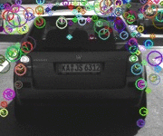

# Project 2: Camera 2D Feature Tracking 
## Sensor Fusion Nanodegree

#### Analysis

##### Number of Keypoints
Below is a list of keypoint detectors sorted in descending order 
based on the mean number of keypoints identified among 10 images. 
The analysis is based on the keypoint data presented in the section 
[Keypoints Statistics](#keypoints-statistics).   
w

| FAST  | BRISK | AKAZE | SIFT | SHITOMASI | ORB | HARRIS |
|-------|-------|-------|------|-----------|-----|--------|
| 413   | 272   | 166   | 138  | 118       | 115 | 24     |

#### Neighborhood distribution 

The keypoints from SHITOMASI, HARRIS and FAST only have (x, y) position information, whereas from BRISK, ORB, AKAZE and SIFT include position, orientation and scale such as (x, y, σ, θ). Below is a gifs of sample keypoints detected on all of the 10 test images. 

<table="width:100%">
  <tr>
    <th>
      

           
            SHITOMASI
      

    </th>
        <th>

           
            HARRIS
        

    </th>
       <th>

           
            FAST
        

    </th>
  </tr>
  <tr>
    <th>

           
            BRISK
        

    </th>
        <th>

           
            ORB
        

    </th>
    <th>

           
            AKAZE
        

    </th>
  </tr>
  <tr>
    <th>

           
            SIFT
        

 </tr>
</table>  
 

