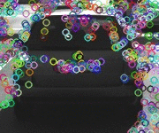
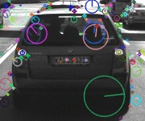

# Project 2: Camera 2D Feature Tracking 
## Sensor Fusion Nanodegree

#### 1. MP.7 Performance Evaluation 1 (Detectors performance)

##### Number of Keypoints
Below is a list of keypoint detectors sorted in descending order 
based on the mean number of keypoints identified among 10 images. 
The analysis is based on the keypoint data presented in the section 
[Keypoints Statistics](#keypoints-statistics).   
w

| FAST  | BRISK | AKAZE | SIFT | SHITOMASI | ORB | HARRIS |
|-------|-------|-------|------|-----------|-----|--------|
| 413   | 272   | 166   | 138  | 118       | 115 | 24     |

#### Neighborhood distribution 

The keypoints from SHITOMASI, HARRIS and FAST only have (x, y) position information, whereas from BRISK, ORB, AKAZE and SIFT include position, orientation and scale such as (x, y, σ, θ). Below is a gifs of sample keypoints detected on all of the 10 test images. 

<table style="width:100%">
  <tr>
    <th>
      

           
            SHITOMASI
      

    </th>
        <th>

           
            HARRIS
        

    </th>
       <th>

           
            FAST
        

    </th>
  </tr>
  <tr>
    <th>

           
            BRISK
        

    </th>
        <th>

           
            ORB
        

    </th>
    <th>

           
            AKAZE
        

    </th>
  </tr>
  <tr>
    <th>

           
            SIFT
        

 </tr>
</table>  

As shown on the output gifs, FAST & BRISK detects most of the keypoints within the preceding vehicle ROI and lies on the edges of the vehicle.

#### 2. MP.8 Performance Evaluation 2 (Matched Keypoints)
For this part, I've counted the number of matched keypoints for all 10 images using all possible combinations of detectors and descriptors. 
In the matching step, Brute Force matching with a distance ratio set to 0.8 has been applied.

Current implementation for detectors are: ["SHITOMASI", "HARRIS", "FAST", "BRISK", "ORB", "AKAZE", "SIFT"].
Current implementation for descriptors are: ["BRISK", "BRIEF", "ORB", "FREAK", "AKAZE", "SIFT"]. 

As a result, there are 42 combinations, but AKAZE descriptors can only be used with KAZE or AKAZE keypoints and I have not find a method to solve the problem of insufficient memory on the combination of SIFT/ORB. At last, I made a statistics on 35 combinations of detectors and descriptors as being showed on the below table.

### Top 3 Performing combination

### Matched keypoints visualization

